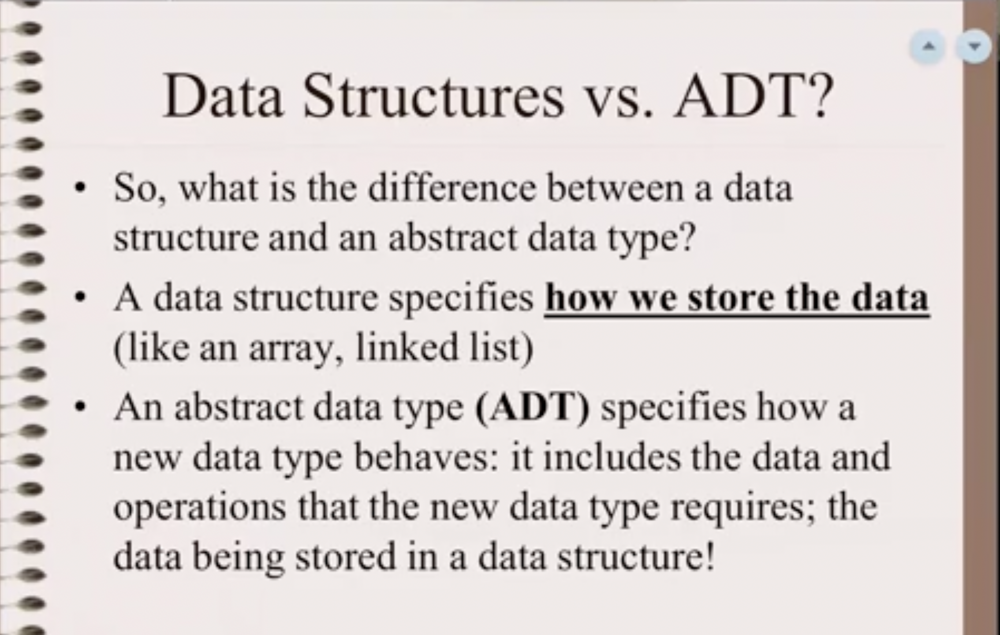

# **Topic 1 Part 1 Video Notes**
## **Abstract Data Types and Linear Linked Lists**
---
## **C++ Paradigms**:
### **Procedural Abstraction:**
Code that can take parameters and handle various forms of situations depending on data input.

*(Small Fuctions meaningful goals.)* 
### **Modular Abstraction:**
Multiple files to solve problems.

### **Data Abstraction**
Creating data types to work with input and handle and allocate memory as implemented using internal methods.

*(Class that manages itself using internal methods to allocate memory)*

### **Object Oriented Programming**
Team of classes (5+ classes) that work together to solve a problem. (Important to avoid meandering).

## What is a Data Structure? 
---
A Data structure is how we use memory to store data. (An Array, A Linear Linked List, Etc)

## What is an ADT?
---
Abstract Data types hides how memory is worked with inside of a class.

## *Difference Between ADT & Data Structures:*
---

ADT Specifies Behavior

A Data structure specifies how data is stored. 

*Examples of ADT*s:
1. Int
2. List
3. Stack
4. queue

## Important Terminology 
---
### **Data Abstraction**
Process of building an abstract data type.

### **Abstract Data Type**
A new data type that we will create. 
It will have:
1. Memory (Behavior)
2. Functions (Data Structure)

### **Data Structure**
How we organize memory.
(Linear Linked List)

### **Client / Client Program**
Client is the user facing side of the program. It takes user input
and calls functions in the ADT. It is expect to have a menu. In the
Context of CS 256 It is effectively a test/best program for the ADT.
User should have no knowledge and not need to even be aware of the ADT.

### **User / Application**
User if effectively test program

### **Using Classes to build ADTs**
---
**Basic Ideas:**
1. Use c++ class construct to build abstract data types.
2. Data (represented by a data structure) are placed in private section.
3. Operations ("Client"/"Application") is in the public section.

**Expanded:**
1. user/client should not be aware of what data structure is being used.
2. Client program shouldn't be aware that there is a node || next 
pointer for linked list, or index to array if array is
used.
3. This allows an Client to "plug and play" w different 
data structures, w/o disruptiion, to maximize efficiency.

**Example Locations of various members:**

1. Data members? (Private)
2. Error messages? (Client program)
3. Input of data? (Client program)
4. Output of Data? (If requested ADT can do this)
5. Prompting? (Client)

*Notes*:

For every member ask yourself if it should be local to a member method (local is fast)

If it does not need to persist it should not be a data data member

<b>The main program is the only place you
should use statically allocated arrays
All arrays must be dynamically allocated in
your class... why?
Think about when an ADT is written vs.
an application. The ADT should be able to
be used by many applications...

Use arguments instead and have the main ()
read from the keyboard (and prompt)
This way, information can come from the
keyboard or a file!!!

And, of course, no global variables are
allowed And, never prompt from a member
function! Think of an int prompting!!!!!</b>
